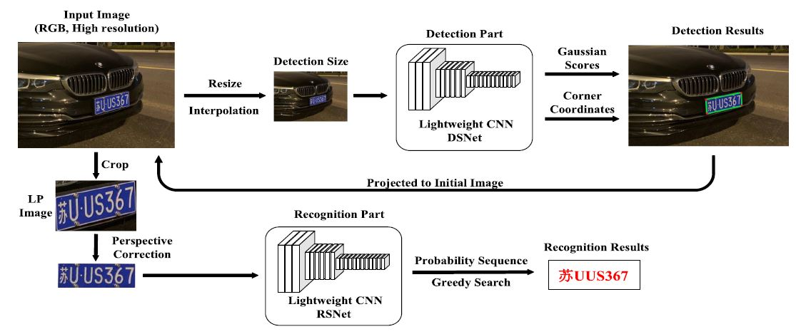
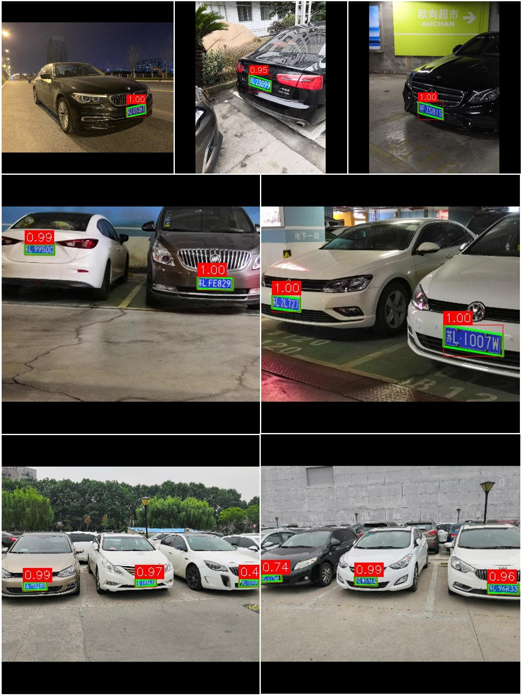

# XLPNet：一个基于旋转高斯分布的轻量化车牌检测与识别算法

## 1 详细介绍见CSDN
:star:[XLPNet车牌识别算法详解系列文章](https://blog.csdn.net/qq_42891019/category_11691340.html?spm=1001.2014.3001.5482)
欢迎点赞收藏！:star:

:star:如果你想试一试XLPNet的效果（目前仅完善了检测部分），但又**不想部署任何的环境**，那么请不要错过这个！ 
``XLPDetection_opencv_exe``  
一个在windows系统下**可直接运行的车牌检测程序**，可以直接对单张车牌图片或者文件夹中图片进行检测（基于opencv库调用XLPNet检测部分网络并进行后处理）。 
链接: [XLPDetection_opencv_exe](https://pan.baidu.com/s/1UcFTCR2zmD3Zz4QzjqJ6nQ)  
提取码：ozt1 
具体使用方法详见博客第一章：[XLPNet车牌识别算法】第一章 序](https://blog.csdn.net/qq_42891019/article/details/123528349)

## 2 项目简介
- 一个诞生于2022年，基于纯卷积神经网络结构的**车牌检测与识别系统**
- XLPNet分为车牌检测与车牌字符识别两部分，具备**轻量化**、**运行高效**的特点
- 算法上具备一些新颖的设计与思考，并非现有方案的简单集成
- 基于**pytorch**构建完整的网络结构与训练体系，支持GPU/多GPU训练
- 提供完整的**opencv调用程序**（包括python版本和C++版本），可以完全摆脱深度学习框架的限制，便于在多种不同平台和系统（Windows/Linux/Raspbian）直接或间接部署使用

很多细节上参考了我之前的工作SLPNet：[SLPNet_pytorch](https://github.com/JackEasson/SLPNet_pytorch)

XLPNet可视为SLPNet的改进版，其处理流程与SLPNet一致，下面给出SLPNet的处理流程：

## 3 目前完成度
- [x] 车牌检测（pytorch模型训练与opencv调用）
- [ ] 车牌识别
- [ ] 完整系统整合

## 4 示例

## 5 使用
详见博客：[【XLPNet车牌识别算法】第四章 检测部分-程序篇](https://blog.csdn.net/qq_42891019/article/details/123797612)
### 5.1 环境要求
pytorch >= 1.6.0 
opencv >= 4.2.0 
tqdm 
numpy 
### 5.2 pytorch部分程序
#### 5.2.1 训练
可以提前修改``config.py``中的内容，大部分超参数可以通过此文件修改
- CPU / 单GPU训练： 
``python train.py --device 'cpu' / 0 / 1/ ... --epoch xxx --batch_size xxx --savedir xxx``
- CPU / 单GPU / 多GPU并行训练： 
``python train_multi_gpu.py --device 'cpu' / 0 / 1/ ... --epoch xxx --batch_size xxx --savedir xxx`` 
注意：这里多GPU训练所得的模型需要转换保存为普通模型，使用``trans_tools.py``中的
``multi_gpu2normal_model()``函数处理。
#### 5.2.2 测试
- 基于角点（高斯得分）的AP测试：``python test.py --weight xxx --savedir xxx(保存测试结果的txt所在路径)`` 
整体流程与传统检测任务AP计算一致，但不是计算预测bbox与GT的IoU，而是**采用高斯得分来判定真正例**。这里的GT是CCPD数据标注中的真实角点信息。
- 基于一般化边界框的AP测试：``python test_ccpd.py --weight xxx --savedir xxx(保存测试结果的txt所在路径)`` 
采用的是将检测所得角点取其外接正矩形，**与GT的边界框计算IoU以判定真正例**，计算AP。这里的GT是CCPD数据标注中的真实边界框信息。

注意，两个测试程序中都包含`split_mode`选项，其作用是是否单独对测试集中每个CCPD子集进行AP测试并输出到txt中:
- `--split_mode False` 测试集整体计算AP
- `--split_mode True` 测试集子集单独计算AP
#### 5.2.3 演示
``python demo.py --device xxx ......`` 
其中`weight`为训练好的pth模型地址，注意`config.py`中的`INP_SIZE`与`BACKBONE`要与模型对应一致，`img_path`为输入文件夹/图片路径，即输入是一张图还是多幅图片所在的文件夹都可以，`savedir`为输出图片保存的位置，保存名称与输入图片相同。
### 5.3 opencv调用部分程序
#### 5.3.1 ONNX模型转换
在上面相同的工程文件夹`XLPDetection/CLPD_pytorch`中： 
1. 使用`trans_tools.py`中的`state_dict2whole_model()`函数将模型权重（直接训练所得的权重pth）转化为包含结构信息的完整pth模型；
2. 使用`transformer/pytorch2onnx.py`中的`trans2onnx()`函数将pth模型转换为onnx模型；
3. 使用`transformer/opencv_onnx.py`中的`opencv_load_onnx()`函数测试上一步所得的onnx能否成功使用opencv库调用。
#### 5.3.2 opencv-python调用
- 这部分程序对应github工程文件夹`XLPDetection/opencv_python`
- 运行`python demo.py`并设置相关超参数即可，其中`image`可以是图片或者文件夹，`weight`为2.1节所得onnx模型，`savedir`为结果图片保存路径；
- 运行程序展示出一张图片，可以按`'s'`键保存，`'q'`键退出，`其他键`进行下一张图的处理。
#### 5.3.2 opencv-cpp调用
- 这部分程序对应github工程文件夹`XLPDetection/opencv_cpp`；
- 主函数见`main.cpp`，注意运行之前需要将`opencv_pythno/weights`中的**onnx模型文件全部放到**`opencv_cpp/weights`中；
- `mode`变量可以设置单图模式和多图模式，`mode=0`检测一张图，`img_path`为待测图路径；`mode=1`为文件夹检测模式，修改`pattern_jpg`中的路径即可。
